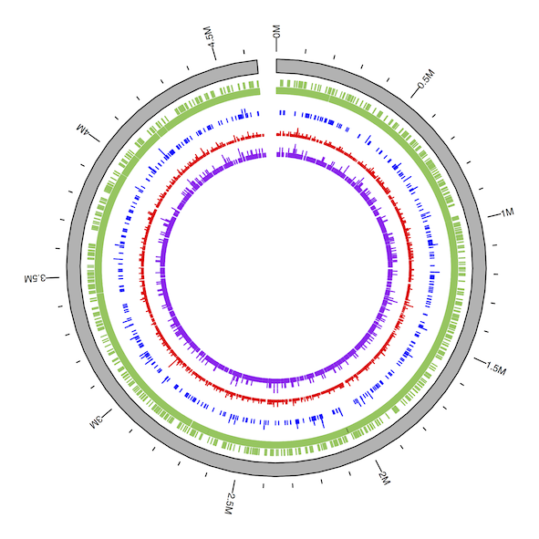

SOFA Supplementary Analysis
---------------------------

This directory contains code, data, and processing information to reproduce the *E. coli* simulation from the SOFA paper:

* Aria S. Hahn, Niels W. Hanson, Dongjae Kim, Kishori M. Konwar, Steven J. Hallam. *Assembly independent functional annotation of short-read data using SOFA: Short-ORF Functional Annotation*, Proceedings of the 2015 IEEE Conference on Computational Intelligence in Bioinformatics and Computational Biology (CIBCB 2015), Niagara Falls, Canada, August 12-15, 2015.

For more information see the RMarkdown document [SOFA_r_analysis.md](SOFA_r_analysis.md).

# Contents

* [data/](data/): folder containing Python scripts, genomic sequences, and Genomic Range files for analysis
* [pdfs/](pdfs/): output pdfs
* [refs/](refs/): pdf reference material for [ggbio](http://www.tengfei.name/ggbio/) and the Genomic Ranges file format
* [scratch/](scratch/): old code
* [SOFA_r_analysis.Rmd](SOFA_r_analysis.Rmd), [SOFA_r_analysis.md](SOFA_r_analysis.md), [SOFA_r_analysis.html](SOFA_r_analysis.html): trio of formatted files detail the simulation and downstream analysis in R