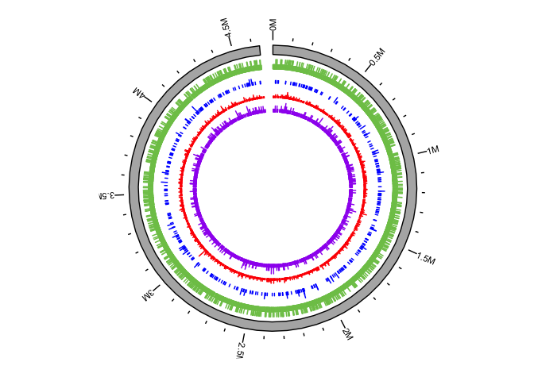

# SOFA Supplementary Methods
Aria S. Hahn, Niels W. Hanson, Dongjae Kim, Kishori M. Konwar, and Steven J. Hallam  
March 28, 2015  

This document demonstrates the details of the *E.coli* simulations validating the Short-ORF Functional Annotation (SOFA) pipeline. For more information see the [GitHub repo](https://github.com/hallamlab/SOFA) or the paper:

* Aria S. Hahn, Niels W. Hanson, Dongjae Kim, Kishori M. Konwar, Steven J. Hallam. *Assembly independent functional annotation of short-read data using SOFA: Short-ORF Functional Annotation*, Proceedings of the 2015 IEEE Conference on Computational Intelligence in Bioinformatics and Computational Biology (CIBCB 2015), Niagara Falls, Canada, August 12-15, 2015.

# Contents

This document references the following files:

* [data/genomic_ranges/NC_000913.3_CDS_gr.txt](data/genomic_ranges/NC_000913.3_CDS_gr.txt): Genomic ranges of simulated reads falling within CDS ranges from *E. coli* simulation (i.e., duplicates)
* [data/genomic_ranges/EcoliSim2_dups_sofa_60.txt](data/genomic_ranges/EcoliSim2_dups_sofa_60.txt):  Genomic ranges of simulated reads falling within CDS ranges from *E. coli* simulation (i.e., duplicates) merged with SOFA results for deduplication 

# E. coli Paired-end Simulation

* Load required libraries


```r
library(ggbio)
library(GenomicRanges)
```

* Load CDS genomic ranges for *E. coli*


```r
ecoli_genome_length = 4641652
ecoli_df <- read.table("data/genomic_ranges/NC_000913.3_CDS_gr.txt", sep="\t", header=T, quote = "")
ecoli_gr <- makeGRangesFromDataFrame(ecoli_df, keep.extra.columns=T)
seqlengths(ecoli_gr) <- ecoli_genome_length
```

* Load duplication ranges and calculate statistics:


```r
# load ranges
dups_df <- read.table("data/genomic_ranges/EcoliSim2_dups_sofa_60.txt", sep="\t", header=T, quote="")

# calculate duplicate count and proportion
dbl_count_table <- table(dups_df$dbl_count)
duplicate_rbs_count <- dbl_count_table["TRUE"]
non_duplicate_rbs_count <- dbl_count_table["FALSE"]
duplicate_rbs_percent <- round(dbl_count_table["TRUE"] * 100 / (dbl_count_table["TRUE"] + dbl_count_table["FALSE"]),2)
non_duplicate_rbs_percent <- round(100 - duplicate_rbs_percent,2)
dedup_duplicate_rbs_count <- nrow(subset(dups_df, dbl_count == TRUE & sofa != FALSE))
dedup_duplicate_rbs_percent <- round(nrow(subset(dups_df, dbl_count == TRUE & sofa != FALSE)) * 100 / nrow(subset(dups_df, dbl_count == TRUE)), 2)
```

* Statistics:
    * Non-duplicate read pairs count and percentage: 1830 (18.3%)
    * Duplicate read pairs count and percentage: 8170 (81.7%)
    * Deduplicated duplicates read pairs count and percentage (i.e., cases where SOFA effectively removed duplicate rps): 7256 (88.81%)


```r
# subsample for plotting
set.seed(31456)
sample_rows <- sample(1:nrow(dups_df), nrow(dups_df)*0.25, replace = F)

# prepare
colors = rep("blue", length(dups_df$dbl_count))
colors[dups_df$dbl_count == TRUE] = "red"
dups_df$colors = colors

dedup = rep("blue", length(dups_df$dbl_count))
dedup[dups_df$sofa == TRUE] = "pink"
dups_df$dedup = dedup

dups_df_small = data.frame(chr=dups_df$chr[sample_rows],
           start=dups_df$start[sample_rows],
           end=dups_df$end[sample_rows],
           strand=dups_df$strand[sample_rows],
           dbl_count=dups_df$dbl_count[sample_rows],
           colors=dups_df$colors[sample_rows],
           sofa=dups_df$dedup[sample_rows])

dups_gr_small <- makeGRangesFromDataFrame(dups_df_small, keep.extra.columns=T)
seqlengths(dups_gr_small) <- ecoli_genome_length
```

* Plot CDS ranges


```r
p1 <- ggbio()
p1 <- p1 + circle(subset(dups_gr_small, sofa=="pink"), geom = "rect", color="purple")
p1 <- p1 + circle(subset(dups_gr_small, colors=="red"), geom = "rect", color="red") 
p1 <- p1 + circle(subset(dups_gr_small, colors=="blue"), geom = "rect", color="blue") 
p1 <- p1 + circle(ecoli_gr, geom = "rect", color = "#7EC658")
p1 <- p1 + circle(ecoli_gr, geom = "ideo", fill = "gray70") 
p1 <- p1 + circle(ecoli_gr, geom = "scale", scale.n=10, size = 3)
p1
```

 

**Figure**: Validation of the debuplication process implemented by SOFA using simulated read pairs from *E. coli strain K-12 (MG1655)*. The grey ring represents the scale in millions of base pairs. The green ring represents the loci of genes on *E. coli K-12*. The blue ring represents non-deduplicated simulated read pairs (i.e., read pairs without deduplication). The red ring represents 'duplicate' simulated read pairs. Finally, the purple ring presents read pairs deduplicated by SOFA.

* Create pdf ([pdfs/ecoli_simulation_circos.pdf](pdfs/ecoli_simulation_circos.pdf)):


```r
pdf("pdfs/ecoli_simulation_circos.pdf")
p1
dev.off()
```

```
## quartz_off_screen 
##                 2
```

Please send questions and comments to Dr. Steven J. Hallam (<shallam@mail.ubc.ca>)
